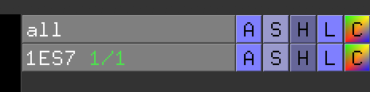
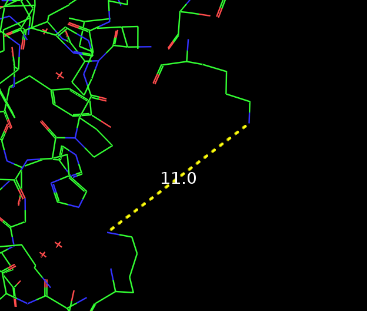
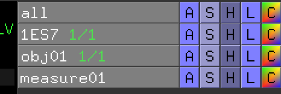
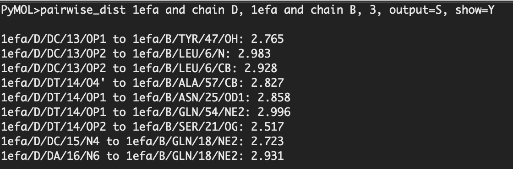

# Measuring atomic distances in a PDB with PyMOL

First, download PyMOL

[PyMOL | pymol.org](https://pymol.org/2/)

Find the PDB ID you'd like to work with. I'll use the BMP-2 and BMP receptor interaction crystal structure. Its PDB ID is `1ES7`

Open PyMOL and click `File > GET PDB`. Put in your PDB ID.

The protein structure should open. Click `Display > Sequence` to show the primary amino acid sequence of the protein. 

In PyMOL you can create objects, and interact with them separate fromt the protein structure you downloaded. On the right hand side you'll notice several options that look like this:

- A: Action
- S: Show
- H: Hide
- L: Label
- C: Color

Click on 1ES7 `H > Cartoon`, then go to 1ES7 `S > Lines`

Lets say we want to calculate the distance between atom **K73** and **K511**. First, select these residues in the amino acid structure – PyMOL will then highlight where they are in the 3D structure. 

Next, click **(selec)** `A > extract to object` on the right hand side menu – this helps keep track of what feature you care about analyzing. 

Then, click `Wizard > Measurement` and manually select one atom in each amino acid to make a distance measurement of. The distance between these these two residues we selected is 11 Angstroms.

You'll notice a **measure01** object being automatically created on the right hand side menu. Because of how interactive this right hand side menu is, PyMOL defaults to creating new objects out of most things, allowing you to either show the distance measurement or hide it, or interact with it in other ways. 

If you want to measure **Angles**, you need to select three atoms after clicking on **Distances** in the bottom right menu. **Dihedrals** require four atoms. Polar, Heavy and all Neighbors need just one. By default, each measurement creates a new object.

## PyMOL scripting example

Let's use another example. Make a new PyMOL window and type `fetch > 1efa`

In Pymol, you can make your own script. There is two kind of scripts 

- **.py**: it’s a python script that allows to add a new function in pymol.to import a py script on pymol write the command line: `run myscript.py`
- **.pml**: it’s a pymol script where you put all pymol command. each lines will be executed one after the other.To run it on pymol write the command line: `@myscript.pml`

In this example script, given any two selections, this script calculates and returns the pairwise distances between all atoms that fall within a defined distance *(in this example, a distance of 3 angstroms).*

This can be used to measure distances within the same chain, between different chains or different objects.

Distances can be restricted to sidechain atoms only and the outputs either displayed on screen or printed on file.

Load this into PyMOL using `run myscript.py`

    from __future__ import print_function
    from pymol import cmd, stored, math
    
    def pairwise_dist(sel1, sel2, max_dist, output="N", sidechain="N", show="N"):
    	"""
    	usage: pairwise_dist sel1, sel2, max_dist, [output=S/P/N, [sidechain=N/Y, [show=Y/N]]]
    	sel1 and sel2 can be any to pre-existing or newly defined selections
    	max_dist: maximum distance in Angstrom between atoms in the two selections
    	--optional settings:
    	output: accepts Screen/Print/None (default N)
    	sidechain: limits (Y) results to sidechain atoms (default N)
    	show: shows (Y) individual distances in pymol menu (default=N)
    	"""
    	print("")
    	cmd.delete("dist*")
    	extra=""
    	if sidechain=="Y":
    		extra=" and not name c+o+n"
    	
    	#builds models
    	m1 = cmd.get_model(sel2+" around "+str(max_dist)+" and "+sel1+extra)
    	m1o = cmd.get_object_list(sel1)
    	m2 = cmd.get_model(sel1+" around "+str(max_dist)+" and "+sel2+extra)
    	m2o = cmd.get_object_list(sel2)
    
    	#defines selections
    	cmd.select("__tsel1a", sel1+" around "+str(max_dist)+" and "+sel2+extra)
    	cmd.select("__tsel1", "__tsel1a and "+sel2+extra)
    	cmd.select("__tsel2a", sel2+" around "+str(max_dist)+" and "+sel1+extra)
    	cmd.select("__tsel2", "__tsel2a and "+sel1+extra)
    	cmd.select("IntAtoms_"+max_dist, "__tsel1 or __tsel2")
    	cmd.select("IntRes_"+max_dist, "byres IntAtoms_"+max_dist)
     
    	#controlers-1
    	if len(m1o)==0: 
    		print("warning, '"+sel1+extra+"' does not contain any atoms.")
    		return
    	if len(m2o)==0: 
    		print("warning, '"+sel2+extra+"' does not contain any atoms.")
    		return
    	
    	#measures distances
    	s=""
    	counter=0
    	for c1 in range(len(m1.atom)):
    		for c2 in range(len(m2.atom)):
    			distance=math.sqrt(sum(map(lambda f: (f[0]-f[1])**2, zip(m1.atom[c1].coord,m2.atom[c2].coord))))
    			if distance<float(max_dist):
    				s+="%s/%s/%s/%s/%s to %s/%s/%s/%s/%s: %.3f\n" % (m1o[0],m1.atom[c1].chain,m1.atom[c1].resn,m1.atom[c1].resi,m1.atom[c1].name,m2o[0],m2.atom[c2].chain,m2.atom[c2].resn,m2.atom[c2].resi,m2.atom[c2].name, distance)
    				counter+=1
    				if show=="Y": cmd.distance (m1o[0]+" and "+m1.atom[c1].chain+"/"+m1.atom[c1].resi+"/"+m1.atom[c1].name, m2o[0]+" and "+m2.atom[c2].chain+"/"+m2.atom[c2].resi+"/"+m2.atom[c2].name)
    
    	#controler-2
    	if counter==0: 
    		print("warning, no distances were measured! Check your selections/max_dist value")
    		return
    	
    	#outputs
    	if output=="S":
    		print(s)
    	if output=="P":
    		f=open('IntAtoms_'+max_dist+'.txt','w')
    		f.write("Number of distances calculated: %s\n" % (counter))
    		f.write(s)
    		f.close()
    		print("Results saved in IntAtoms_%s.txt" % max_dist)
    	print("Number of distances calculated: %s" % (counter))
    	cmd.hide("lines", "IntRes_*")
    	if show=="Y": cmd.show("lines","IntRes_"+max_dist)
    	cmd.deselect()
      
    cmd.extend("pairwise_dist", pairwise_dist)

Then run this command in PyMOL:

`pairwise_dist 1efa and chain D, 1efa and chain B, 3, output=S, show=Y`

The output here is giving you distances between all neighoring atoms that are 3 angstroms away.

